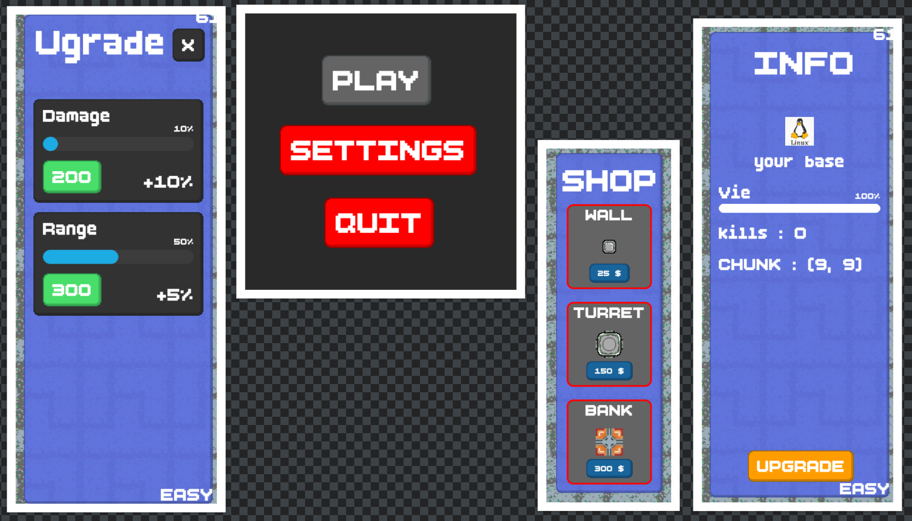
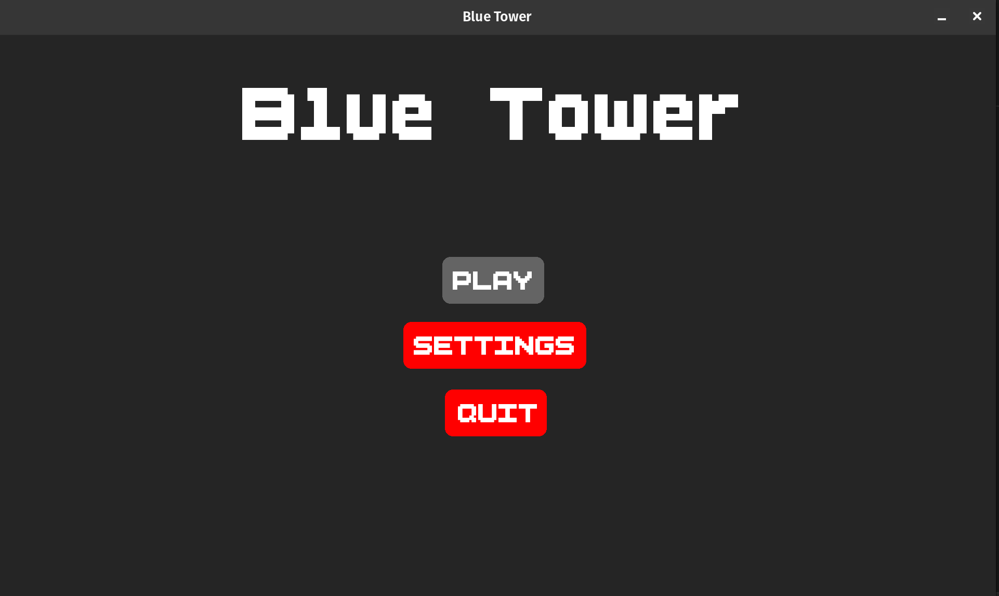
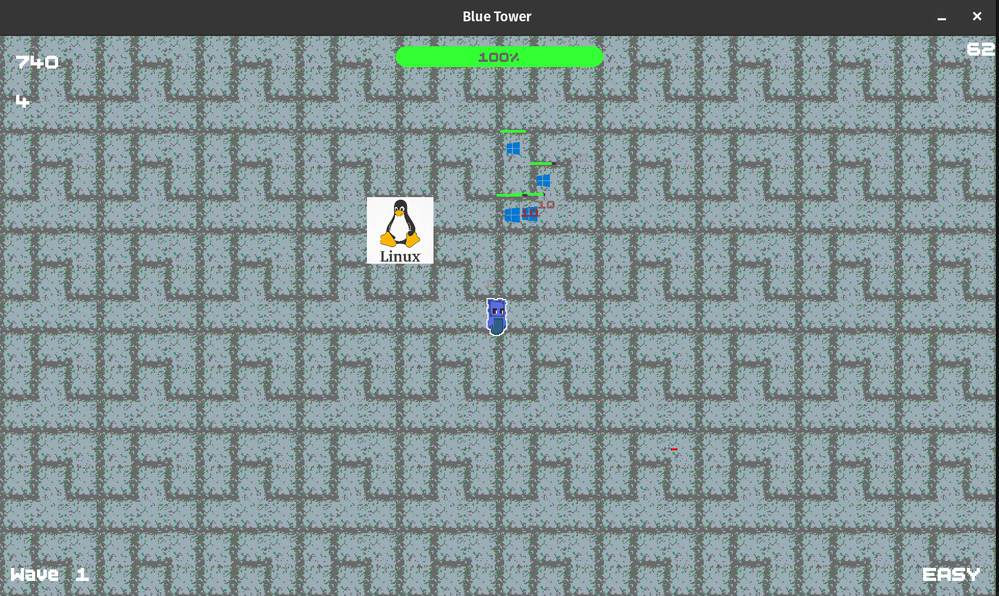
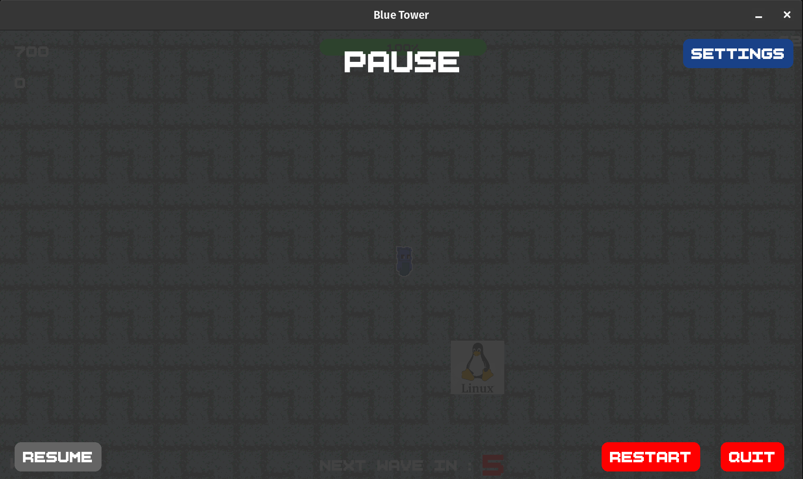
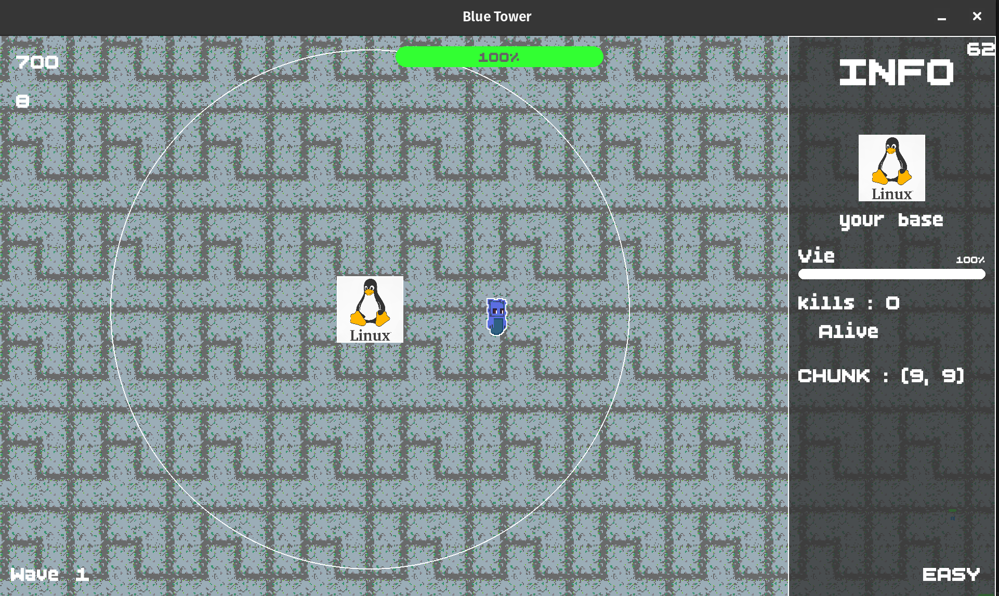
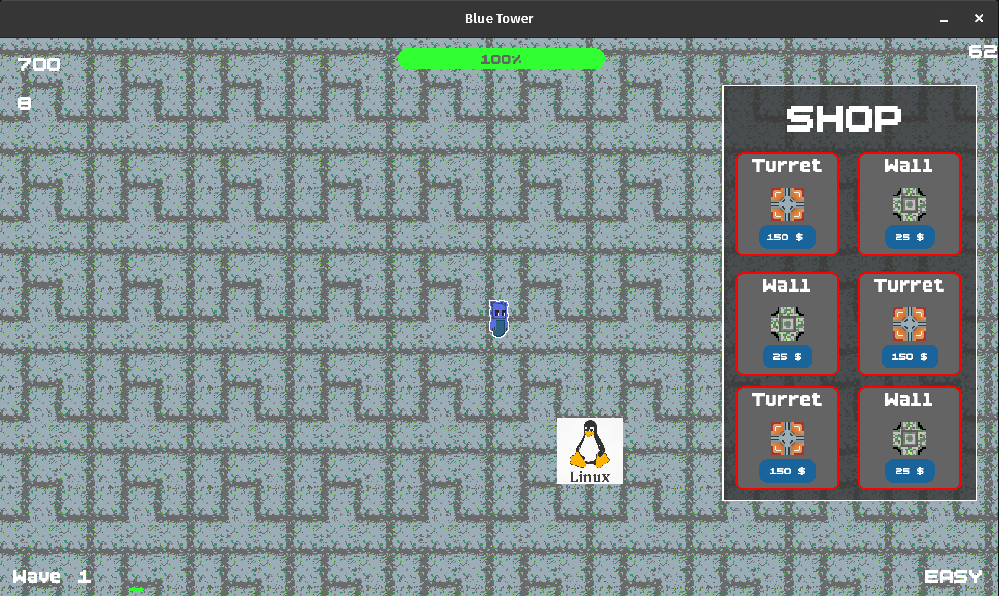
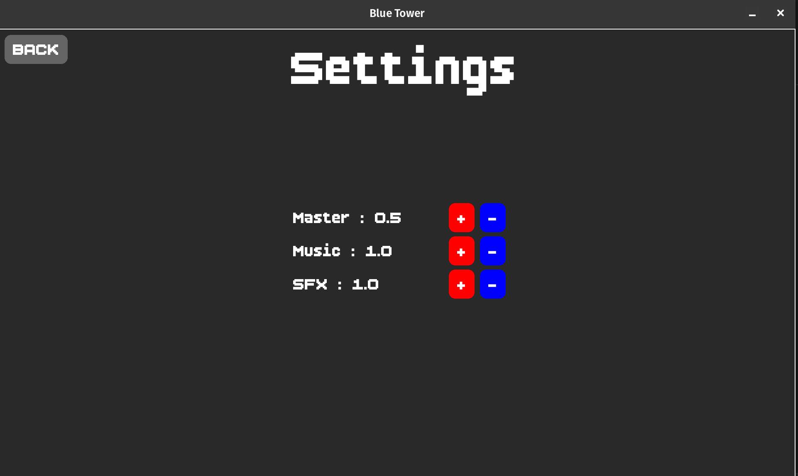

## Future MAJ/Ajout pour le jeu (d'ici la fin avril)
Un systeme d'armes pour le joueurs.

## Update du JOUR ( 19 avril )
Ajout de surface pixel pour respecter plus la DA du jeu

### voici un petit screen de cet Ajouts :



## [Challenge](CHALLENGE.md)

* Je metrai ici tout les petits et grands defis du jeu que ceux qui ont le coeur de les relever et comme ca 
participer au projet tout en apprenant de nouvelles choses !

* comming soon...

# BLUE TOWER #
Est un jeu tower defense/degestion une sorte de `Bloon TD5` fusionner avec un `Clash of Clan` le tout code en python avec Pygame.

## Histoire du jeu
Blue est une petite créature bleue, qui se retrouve seule au milieu d’une île déserte. Pensant être seul, il part à la découverte de ce nouveau monde, mais il se rend très vite compte qu’il n’est pas le seul à s’être retrouvé ici, qu’il y aurait un peu plus que du hasard pour que d’autres créatures comme lui se retrouvent comme lui. Pour survivre face aux autres créatures hostiles, il va devoir explorer, et améliorer son campement pour survivre le plus longtemps et qui sait, peut-être pourra-t-il lui aussi rejoindre les ```grands``` …

## Fonctionnalités du moteur de jeu :
Pour l’instant, le jeu embarque un éditeur d’UI, ce qui permet de manière visuelle de déplacer les éléments affichés à l’écran comme le score, les boutons ou encore les éléments du shop, juste avec la souris en activant le mode edit via la touche F1. 

Il emporte aussi avec lui pleins d’éléments de base comme un UIgraph avec de nombreux UIelement pour pouvoir développer de manière rapide son UI. 

On y retrouve aussi un système d’entité, une caméra et une scène. Ce qui permet de facilement diviser son jeu en couches logiques. 


``` 
App -> Managers -> Entity
 |       |
 |       -> Camera
 -> UI
``` 

```
L'idée derrière ce jeu est d’apprendre la programmation et le Game Dev.
```

## Quelques images de mon jeu

### Blue 

 personnage principale [ vue de face ]

### Image (Menu/Pause/Shop/Ingame)
#### MENU

#### IN-GAME

#### PAUSE

#### INFOPANEL

#### SHOP

### SETTINGS



## how to play
pour les deplacements : WASD ou les fleches directionnelles
pour ouvrire le shop : G
pour activer le monde construction : E <- pas besoin car automatique lors de l'achat d'un batiment
pour mettre en pause : ESC

### Lors de la construction :
clique gauche pour poser et construire
clique droit pour annuler/arreter de construire avec le batiment selcetionner

### pour aller plus loin ( Dev ):
la touche F1 pour activer le `UIeditor`
    -> `ctrl + s` pour sauvgarder la position

#### CTRL + ...
    - S  ----> save le layout de notre UI
    - T  ----> permet de save le GraphTree dans un json pour le debug

et touche `C` pour le debug des chunks

## Pour y jouer
rendez vous dans la section Release de ce repo et telecharger la dernier version qui corresepont a votre OS !


## Installation pour dev
Pour installer et test mon jeu, rien de plus simple : 

Clone le repo avec la commande suivante
```
git clone https://github.com/Lumosity23/Blue_tower.git
```

### Installer UV si vous ne l'avez pas ( c'est un packages manager comme pip mais en mieux )

#### pour linux :
```
sudo apt install uv
```

#### pour windows :
```
winget install uv
```

#### ensuite utiliser uv pour sync votre clonage pour avoir le meme environemnt que moi :
```
uv sync
```

#### pour finir pour lancer le jeu executer simplement la commande suivante :
```
uv run src/main.py
```

## Appropos de moi

Je suis un dev junior, j'apprend la programation depuis maintenant `4 mois`, j'essaye de faire ce qui me passe par la tete tout en ecoutant les retours de mes amis sur mon projet.

## [CREDITS](CREDITS.md)
### Merci a tous les testeurs

Retrouvez leur retours dans cette section : [FEEDBACK](FEEDBACK.md)